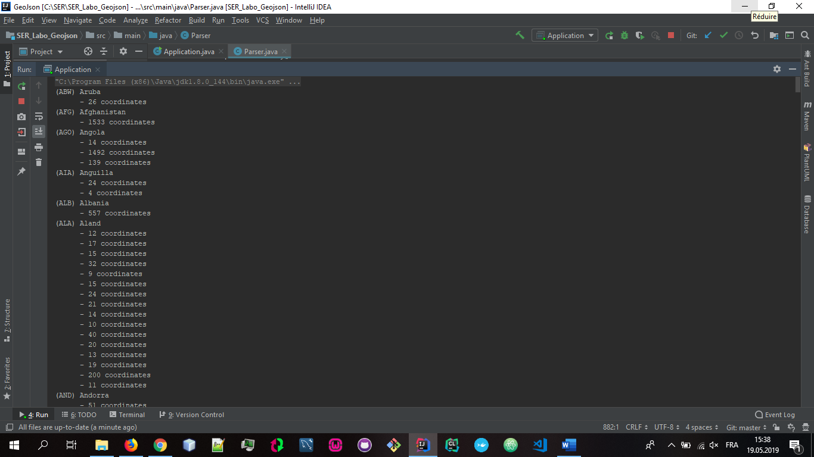
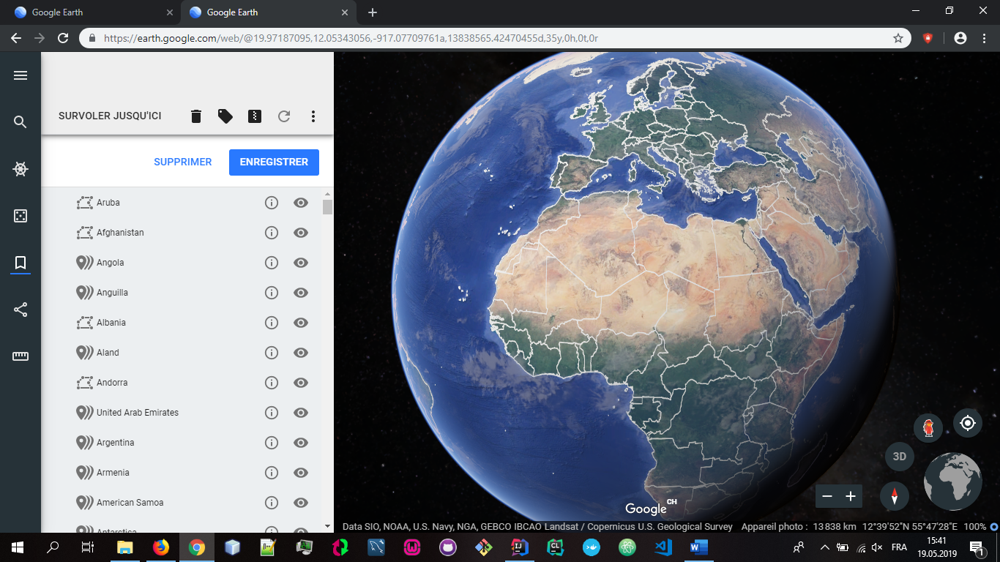

# SER - Laboratoire 3 - GEOJSON -> KML
## Auteurs : Guillaume Laubscher, Samuel Mettler, Nemanja Pantic    

## Descriptif des classes  

Dans le cadre du développement de notre projet nous avons développé 2 classes : 

Application.java :  
Cette classe représentant la classe exécutable de ce projet. Son but est de lancer le parsing du geoJSON. 

Parser.java :
Cette classe représente la plus grosse partie de ce projet. Comme son nom l'indique, cette classe va se charger de parser le document donné en input et de stocker le résultat dans un fichier ouput. Ici on a en input `data/countries.geojson` et en output `data/countries.kml`.
Pour chaque feature (chaque pays) on va récupérer toutes les informations grace à la methode parseFeaturesArray. Cette methode va en effet traiter chaque pays, peu importe sa géométrie. En effet, si le pays est un polygon classique ou un multipolygon la methode parsePolygon sera appelé.   
La méthode parseFeaturesArray va également généré l'output demandé.

## Principales difficultés

Une des principales difficultés que l'on a rencontré dans ce labo était la gestion des "InnerBoundary", c'est à dire quand le pays à des frontières internes (comme l'Italie avec le Vatican).  
On a également rencontré des problèmes lorsqu'on a essayé de spliter le projet en plusieurs classes afin d'être le plus orienté objet possible. 
Trouver les bonnes balises à récupérer et comment appliquer des styles à un polygon nous ont également tracassé un certain moment.

## Problème connu

A notre connaissance, aucun problème n'est présent.

## Affichage des résultats
Affichage du parsing :  

  
Resultat sur google Earth :

## Nos apprentissages

Ce projet nous a fait prendre conscience d'un nouveau type de fichiers (KML/GEOJSON). Nous avons également utilisé des fonctions anonymes, ce qui n'était pas forcément évident pour tous les membres du groupes.  

## Conclusion

Pour conclure, ce projet a été intéressant car ils nous a fait prendre conscience de ce que pouvait utiliser google dans son tool map et nous sommes satisfait du projet que nous rendons.